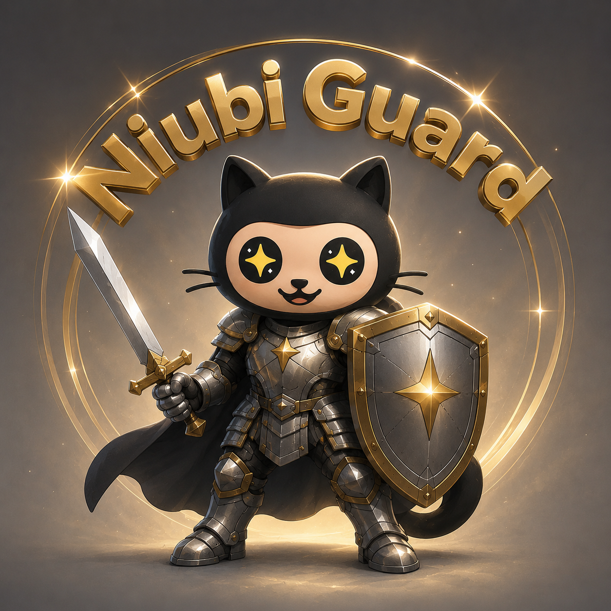

<p align="center">
  
</p>

<p align="center">
  <a href="https://trendshift.io/repositories/45999?utm_source=trendshift-badge&amp;utm_medium=badge&amp;utm_campaign=badge-trendshift-45999" target="_blank" rel="noopener noreferrer">
    
  </a>
</p>

Trendshift は GitHub の日次トレンドリストのスナップショットを取得し、独自のトレンドリストを運営しています。上記の動的バッジは、このリポジトリが各プラットフォームで到達した最高順位を示しており、順位が上がると自動的に更新されます。

# Niubi Guard

<p align="center">
  <a href="https://github.com/Albert-Weasker/niubi_guard/blob/main/docs/protected-by-niubi-guard.md">
    
  </a>
</p>

GitHub のメンテナーをスパム、ハラスメント、組織的な攻撃から守る、無料のオープンソース防御システムです。

[Apache-2.0 License](./LICENSE) · [ホームページ](#web-ui) · [GitHub](https://github.com/Albert-Weasker/niubi_guard) · [English](./README.md) · [简体中文](./README.zh-CN.md) · [日本語](./README.ja-JP.md)

[機能](#機能) · [インストール](#インストール) · [Web UI](#web-ui) · [AI 検出](#ai-検出) · [設定](#設定) · [Protected バッジ](docs/protected-by-niubi-guard.md) · [CLI](#cli) · [コントリビューション](#コントリビューション)

最新の脅威レポート: [第四波 GitHub Issue 攻撃レポート](docs/fourth-wave-attack-report.md) · [攻撃コーパス](docs/attack-corpus.md)

Niubi Guard は、ポリシーを隠すことなくメンテナーがリポジトリを守れるように支援します。検出シグナル、ユーザー、許可リスト、モデル、プロンプト、信頼度しきい値、対応アクションはすべて自分で選択できます。デフォルトはドライランです。強力なアクションは、明示的に設定して apply モードで実行した場合にのみ行われます。

このプロジェクトは、メンテナーから組織的な攻撃 — 悪意ある Issue、繰り返されるコピペの言いがかり、評判への圧力キャンペーン — の報告を受けて作られました。同じパターンに遭遇するメンテナーは増え続けています。通常のプロジェクト宣伝は許容されます。組織的なハラスメントは許容されません。

> **悪意ある Issue によるハラスメントを受けていますか?** どのメンテナーも自分のリポジトリに Niubi Guard をデプロイできるほか、[niubistar.com/guard](https://www.niubistar.com/guard) の無料ホスト版を利用したり、進行中の攻撃の把握と対応について [support@niubistar.com](mailto:support@niubistar.com) に相談したりできます。

## 機能

**透明性。** すべての検出には、ラベル、一致したキーワードまたはユーザー名、AI の信頼度、理由、証拠、予定されるアクションが付属します。

**ユーザー主導。** 削除、クローズ、ロック、ブロック、インタラクション制限の各アクションは、メンテナーが明示的に有効化するまで無効のままです。

**AI 活用。** OpenAI 互換の任意のモデルを使用できます。ベース URL、API キー、モデル、プロンプト、信頼度しきい値を自由に持ち込めます。

**オープンソース。** 防御ロジック、UI、CLI、設定スキーマ、プレースホルダーのブランド素材は、メンテナーが検証・改善できるよう公開されています。

**多言語対応。** 初回リリースでは、Web UI とドキュメントで英語と简体中文をサポートしています。

## インストール

npm から CLI をインストール:

```bash
npm install -g niubi-guard
niubi-guard init
niubi-guard scan --config guard.config.json
```

またはソースから実行:

```bash
git clone https://github.com/Albert-Weasker/niubi_guard.git
cd niubi_guard
pnpm install
```

Web UI を起動:

```bash
pnpm dev:web
```

その後 `http://localhost:3000` を開いてください。ポートが使用中の場合、Next.js は別のポートを選択します。

CLI でドライランを実行:

```bash
export GITHUB_TOKEN=github_pat_xxx
pnpm dev -- init
pnpm scan -- --config guard.config.json
```

Docker で実行:

```bash
docker build -t niubi-guard .
docker run --rm -p 3000:3000 niubi-guard
```

## Web UI

UI はプロダクトコンソール兼ポリシービルダーです:

- GitHub トークンとリポジトリリスト
- 検出シグナルとユーザー名防御
- 許可フレーズと許可ユーザー
- OpenAI 互換の AI 検出
- 信頼度しきい値とプロンプト編集
- レビューのみ / 自動プランモード
- ドライラン / apply モード
- 検出ラベル、理由、AI 信頼度、予定アクションを含むスキャン出力
- 組み込みの操作マニュアル(バイリンガル)を備えた **Docs ボタン**

API キーはアプリに保存されません。ブラウザは現在のスキャンリクエストのためだけに送信します。

## AI 検出

Niubi Guard は、OpenAI 互換モデルを使って自分のリポジトリの Issue とコメントをスキャンできます。明白なシグナルを含むとは限らないセマンティックな攻撃を検出するように設計されています:

- 悪意ある Issue
- ボットのような報告
- 組織的なハラスメント
- スパムキャンペーン
- 大量メンションの濫用
- テンプレートベースのコピペ攻撃

アダプターは次を呼び出します:

```text
POST {baseUrl}/chat/completions
```

モデルは厳密な JSON を返す必要があります:

```json
{
  "malicious": true,
  "confidence": 0.91,
  "label": "fake_star_accusation",
  "reason": "The Issue repeats an accusation template without project-specific evidence.",
  "evidence": ["same allegation pattern", "no technical detail"]
}
```

デフォルトでは、LLM の検出は `review_only` です。高信頼度の AI 検出から、有効化済みポリシーに基づく予定アクションを作成したい場合にのみ `auto_plan` に切り替えてください。

## 設定

`guard.config.json` を作成します:

```json
{
  "repositories": ["owner/repo"],
  "rules": {
    "keywords": ["spam template", "copy-paste", "mass mention", "repeated link"],
    "denyUsers": ["suspicious-login"],
    "allowPhrases": ["good-faith report", "security disclosure"],
    "allowUsers": ["trusted-maintainer"],
    "coldStartAccounts": {
      "enabled": false,
      "maxAccountAgeDays": 30,
      "requireEmptyBio": true,
      "requireMissingAvatar": false,
      "minimumSignals": 2
    }
  },
  "scan": {
    "includeIssues": true,
    "includeComments": true,
    "state": "open",
    "since": null,
    "maxPages": 5
  },
  "llm": {
    "enabled": false,
    "baseUrl": "https://api.openai.com/v1",
    "apiKey": "",
    "model": "gpt-4o-mini",
    "temperature": 0.1,
    "confidenceThreshold": 0.8,
    "reviewMode": "review_only",
    "systemPrompt": "You are Niubi Guard, a GitHub repository abuse detection classifier. Detect spam, harassment, coordinated attacks, and template-based abuse. Do not flag good-faith criticism or valid reports.",
    "userPromptTemplate": "Repository: {{repoFullName}}\nType: {{sourceType}}\nAuthor: {{actorLogin}}\nTitle: {{title}}\nBody:\n{{body}}"
  },
  "actions": {
    "deleteComments": false,
    "closeIssues": false,
    "lockIssues": false,
    "deleteIssues": false,
    "blockUsers": false,
    "setInteractionLimits": false
  },
  "interactionLimits": {
    "limit": "existing_users",
    "expiry": "one_month"
  }
}
```

破壊的なアクションはデフォルトで無効です。メンテナーはリポジトリのポリシーに応じて有効化できます。

`rules.coldStartAccounts` はオプションで、デフォルトでは無効です。有効にすると、Niubi Guard は各アクターのプロフィールを補完し、作成されたばかりに見え、bio が空で、オプションでアバター URL を持たないアカウントからのインタラクションをフラグ付けできます。`minimumSignals` は、イベントに `cold_start_account` のラベルが付くまでに一致する必要がある有効シグナルの数を制御します。

## CLI

スターター設定を作成:

```bash
niubi-guard init
```

ドライラン:

```bash
niubi-guard scan --config guard.config.json
```

有効化済みアクションを適用:

```bash
niubi-guard scan --config guard.config.json --apply
```

`--apply` を付けない場合、Niubi Guard は検出結果と予定アクションを表示するだけです。

## 開発

```bash
pnpm install
pnpm check
pnpm build
npm pack --dry-run
```

npm パッケージは `dist/` から CLI / ライブラリのサーフェスを公開します。Next.js の Web UI は、`pnpm build`、`pnpm start:web`、または同梱の Dockerfile を通じて別途ビルド・デプロイされます。

## コントリビューション

以下の貢献を歓迎します:

- 攻撃サンプル
- 誤検知(false positive)サンプル
- プロンプトの改善
- モデルアダプターの改善
- 翻訳
- UI とアクセシビリティの改善
- GitHub App、GitHub Action、セルフホストデプロイのアイデア

Issue やプルリクエストを作成する前に、[CONTRIBUTING.md](./CONTRIBUTING.md)、[SECURITY.md](./SECURITY.md)、[CODE_OF_CONDUCT.md](./CODE_OF_CONDUCT.md) をお読みください。

Niubi Guard は防御目的のプロジェクトです。グロースサービスの提供、指標の操作、公式の真実の宣言は行いません。メンテナーが自らコントロールできる、透明性のあるリスク検出・対応システムを提供します。

## Star History

[](https://www.star-history.com/#Albert-Weasker/niubi_guard&Date)

## ロードマップ

- `v0.1`: ルール検出、AI 検出、Web UI、監査出力、手動対応
- `v0.2`: レビューキュー、ラベル、誤検知管理
- `v0.3`: 脅威フィンガープリントとコミュニティ脅威フィード
- `v1.0`: GitHub App、GitHub Action、セルフホストデプロイ
